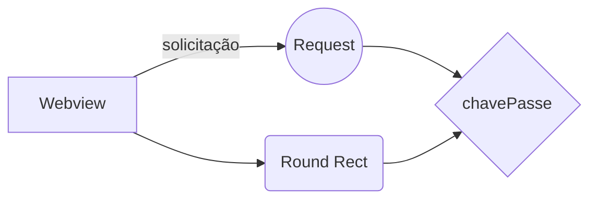

# Mosia Omnichannel - chavePasse!

Este código tem como finalidade ajudar no entendimento sobre o conceito/funcionamento da chavePasse no produto Mosia Omnichannel, não detendo nenhum dado sensível por parte da Mobile Saúde ou de qualquer Operadora

# Conceitos

A **chave passe** é um _token_ temporário que será repassado via queryString para a sua _WebView_ no ato que ela for acionada pelo usuário do aplicativo. Por meio deste token a sua aplicação poderá acionar a [API de DADOS](https://mobilesaudejira.atlassian.net/wiki/spaces/MO/pages/2463989776 "/wiki/spaces/MO/pages/2463989776") da plataforma Mosia Omnichannel para obter os dados do usuário logado e do seu grupo familiar, assim como dados de sistema.

A validade do Token da Chave Passe é de 10 minutos, sendo assim, a sua aplicação deve acionar a API para obter os dados que precisa assim que ela for executada. Caso precise dos dados ao longo do ciclo de vida da sua WebView, faça um cache local.

# url
É possível hospedar esta página como webview na aplicação da Operadora e assim verificar qual a chavePasse está sendo retornada e assim preencher os outros parametros conforme as instruções abaixo.

[REQUEST ChavePasse](https://rannyzyzz.github.io/sample-mosiaOmnichannel/sample-mosiaOmnichannel.html)

# Parametros de request
Para realizar o request a partir da url acima os parametros são adquiridos no painel público do Mosia Omnichannel

|Parametros                |Documentação       |Link                         |
|----------------|-------------------------------|-----------------------------|
|Chave Passe|`Introdução à Chave Passe`            |[Link - 1](https://mobilesaudejira.atlassian.net/wiki/spaces/MO/pages/2460057604/Introdu+o+Chave+Passe)            |
|Chave Funcionalidade|`Cadastro da Funcionalidade Customizada WebView`            |[Link - 2](https://mobilesaudejira.atlassian.net/wiki/spaces/MO/pages/2465595490/Cadastro+da+Funcionalidade+Customizada+WebView)            |
|Authorization|`Api clientes - Autenticação`|[Link - 3](https://mobilesaudejira.atlassian.net/wiki/spaces/MO/pages/2533195788/Api+clientes+-+Autentica+o)
|

# Fluxo 

